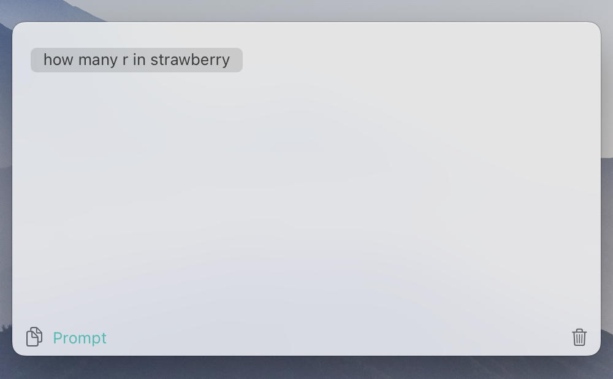

  

  

<h1 align="center">PromptPane Prompts Explore and Expand Your Creativity</h1>

A curated collection of prompt files to enhance your experience with the <a href="https://apps.apple.com/us/app/promptpane/id6741926369">PromptPal macOS application</a>.

## Features

This repository provides a diverse range of prompts, categorized to help you quickly find inspiration and boost your productivity with PromptPane. Whether you're brainstorming, generating images, writing content, conducting research, or seeking handy tools, you'll find prompts here to get you started.

## How to Use These Prompts

1.  **Download .txt Files:** Browse the categorized folders and download the `.txt` file that contains prompts you want to use.
2.  **Import into PromptPane:**   Simply Drag and Drop the downloaded `.txt` file directly into the PromptPane window to import the prompts into your Pages.
3.  **Copy and Paste (Alternative):**  Alternatively, you can directly copy and paste prompt text from any file in this repository into PromptPane.

## Prompt Categories

This repository is organized into the following categories to help you find the perfect prompts for your needs:

### 🧰 General

*   **Description:**  Versatile prompts suitable for a wide range of tasks, from sparking general creativity to aiding everyday brainstorming and problem-solving.

### 🎨 Image Generation

*   **Description:**  Prompts specifically crafted to generate stunning and imaginative visuals using AI image generation models.

### ✍️ Writing

*   **Description:**  Prompts designed to assist with various forms of writing, from blog posts and emails to creative content and marketing copy.

### 🔍 Research

*   **Description:** Prompts to guide research processes, formulate effective questions, and explore topics in depth.

### 🛠️ Tools

*   **Description:** Practical prompts that function as helpful tools for productivity, task management, and organization within PromptPal.

## Contribute

If you've created valuable prompts for PromptPane and want to share them with the community, contributions are welcome!  

